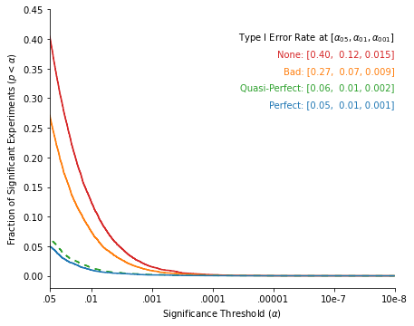

If you've never done it before, or even if you've only done it a few times, pre-registration can feel intimidating.

* What if your pre-registration is not detailed enough?
* What if you forget something?
* What if your design is complex, and you pre-register the wrong analysis?
* What if you pre-register 400 participants, but then a pandemic hit, all the labs around the world are closed, and you only get 300 responses? (Complete hypothetical scenario, never happened to me before).

While these are valid concerns, your conclusion should never be "I won't pre-register this study". Why? Because **even a "bad" pre-registration is dramatically better than no pre-registration.**

Let's see how.

## First, a Recap: The Benefits of Pre-Registration

There are two main benefits to pre-registration:

### It helps us (researchers) stick to our planned analysis, and generate fewer false-positives.

Let's assume a researcher who ran a study to test the hypothesis that anthropomorphic potatoes are perceived as as more "friendly" than anthropomorphic asparagus. Without a pre-registration, it can be tempting to decide, after seeing the data, that *actually* the effect will only work on men. Or that "warm" is a better measure of friendliness than "friendly", at least for a vegetable. Or that they should exclude the 10% of participants who failed an attention check. Or that they should control for the agreeableness of the participants. Or that since the effect is encouragingly trending in the right direction, they should add a few participants to be sure. You get the idea: A pre-registration keeps our ["researchers' degrees of freedom"](https://journals.sagepub.com/doi/pdf/10.1177/0956797611417632) in check. It encourages researchers to stick to their original idea of how the data should be collected, transformed, and analyzed, which minimizes the odds of false-positive results.

### It allows others (reviewers and the readers) to interpret the p-values contained in a paper.

A p-value loses its meaning when the null hypothesis is not defined a priori. If a study is not pre-registered, the reader cannot tell if a p-value reported in the paper is the smallest out of 20 different tests that the researchers ran, or the output of the single test that the researchers had planned to run before seeing any data. A pre-registration allows the readers to determine how "severe" the statistical test was, and therefore how much evidence against the null the p-value actually provides.

Now, why would a "bad" pre-registration (i.e., one that is incomplete, or incorrect, such that one would deviate from it when analyzing the data) be so much better than no pre-registration?

## Combinatorics, That's Why!

Let's go back to our researcher studying the friendliness of anthropomorphic vegetables. We will assume that this researcher has the following degrees of freedom available to them:
* How many participants to collect: 50 per cell, or 100 per cell.
* Which participants to include in the analysis: Men only, women only, or both.
* Which dependent variable to use: "Friendly" or "Warm" (these variables are correlated at r = .5).
* Whether to exclude the 10% of participants who will fail the attention check.
* Whether to control for the agreeableness of the participant.

In total, the researcher has 3 x 2 x 2 x 2 x 2 = 48 different possible specifications that they can run.

Now, imagine that this researcher decides to write an extremely minimal pre-registration: The only thing that the pre-registration states is is "We will collect 50 participants per cell, for a total of 100 participants." That's it.

It's a very bad pre-registration, one that addresses only *one* of the many degrees of freedom available to the researcher. And yet, by restricting a *single* degree of freedom, the number of possible specifications is *halved*: The researcher can now only run 3 x 2 x 2 x 2 = 24 specifications.

This is because degrees of freedom are combinatorial: They do not add up, they get multiplied. For this reason, the benefits of controlling for degrees of freedom are not linear: Dropping just one or two degrees of freedom can have a dramatic impact on the number of specifications that the researcher can run.

How would that actually affect the researchers' likelihood of finding a false-positive?

## Simulating Degrees of Freedom

To answer this question, I used one of my favorite tools: Simulations!

I generated a large number (10,000) of simulated experiments testing the friendliness of anthropomorphic vegetables. In these datasets, the null hypothesis is true: People find anthropomorphic potatoes and anthropomorphic asparagus equally friendly ([but what do I know, maybe they don't!](https://veggietales-the-ultimate-veggiepedia.fandom.com/wiki/Archibald_Asparagus)).

For each dataset, I calculated the **smallest p-value that the researcher would obtain** under four different constraints:
* No pre-registration: The researchers is free to try all 48 of the specifications described earlier.
* A bad pre-registration: The researcher is constrained to run 100 participants, but is free to try all the other 24 specifications.
* A quasi-perfect pre-registration: The researcher pre-registered almost everything, but forgot to specify whether they'll exclude the participants who failed the attention check, such they can try 2 specifications.
* A perfect pre-registration: The researchers can only run the 1 specification they pre-registered.

The graph below shows the distribution of the p-values that these procedures will generate.

    

    

The lines that you see in this figure are called survival curves: They show the percentage of experiments that produced a significant result (on the y-axis) at a given significance threshold (on the x-axis).

We first see that when we have a perfect pre-registration (the blue line), the false-positive rates are nominal:
* 5% of the experiments yield a significant result at α = .05
* 1% at α = .01
* .1% at α = .001

This isn't surprising: As discussed earlier, the main benefit of pre-registration is to maintain false-positive rates at their nominal level.

We also see that when there is no pregistration (the red line), the false-positive rates jump to unacceptable levels:
* 40% of the experiments yield a significant result at α = .05
* 12% at α = .01
* .15% at α = .001.

This isn't, again, a surprising result: We know that many uncontrolled researchers' degrees of freedom lead to inflated false-positive rates.

The interesting result is what happens with our "bad" pre-registration (the orange line), which is just removing a single degrees of freedom: It dramatically drops the false-positive rates!
* 27% of the experiments yield a significant result at α = .05 (a 33% drop)
* 7% at α = .01 (a 40% drop)
* .09% at α = .001 (a 43% drop)

These false-positive rates are still unacceptably high: It is, after all, a terrible pre-registration... But they are much lower than the alternative of not pre-registering.

Finally, we see that our imperfect pre-registration (leaving only one degree of freedom to the researcher) achieves false-positive rates that are elevated, but very close to those of a perfect pre-registration. This should be an encouraging result for people who are afraid of making mistakes in their pre-registration!

## Concluding Thoughts

For authors:

* Don't be afraid to pre-register. It can feel intimidating if you've never tried it, but there are [excellent ressources available explaining how to write good pre-registrations](http://datacolada.org/64), and the platform [aspredicted.org](aspredicted.org) makes it really easy.
* Even if you fear you will make mistakes, or think you will deviate from your pre-registration, you should still pre-register your studies: The improvement in false-positive rates you'll achieve is worth it.

For reviewers and readers:

* If a study is not pre-registered, you cannot know how many degrees of freedom were exerted by the researchers: Maybe none, maybe many. As a reader, this should lead you to exert caution when interpreting the p-values, [particularly if they are between .01 and .05](http://datacolada.org/45). As a reviewer, it might be a cue to ask for a pre-registered replication of the finding.
* Not all pre-registrations are equal. Reading "the study was pre-registered" doesn't tell you how many researchers' degrees of freedom were controlled for. This can only be assessed by carefully reading the pre-registration, and comparing it to the design of the study.
* Don't automatically assume that any deviation from the pre-registration means a false-positive result. It is a counter-productive attitude that can discourage people from pre-registering. As shown in the simulations above, deviations can have a minor impact on false-positive rates as long as 1) the original pre-registration controlled for most (ideally all) the researchers' degrees of freedom and 2) the deviation(s) are small and limited in scope.
* On the contrary, deviations should raise eyebrows when 1) there are many of them, 2) when the original pre-registration was vague, and 3) when the p-value is large.

