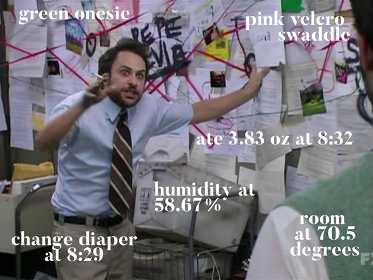
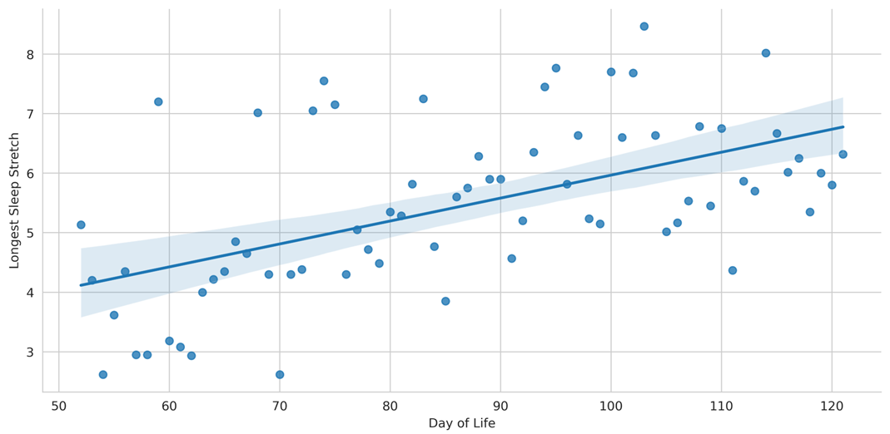

## Sleeping Like a Baby

In November 2022, my wife and I welcomed our first child into our lives. It turns out a lot of things change when you go from zero to one kid... the most dramatic change of all being the amount of sleep that you get.

A few parents are apparently blessed with "unicorn babies" who quickly learn how to sleep through the night. Good for them. The majority of parents will quickly learn that "sleeping like a baby" is one of the most misleading idiom of the English language. For the least fortunate of parents, baby sleep will even become a source of existential dread. The type of dread that will lead you to buy (but never read) 800-page-long treaties on baby sleep; to endlessly scroll "sleep consultant" accounts on Instagram for guidance; or to ask reddit at 2AM "why is my child waking up every two hours". As you can guess from these suspiciously detailed examples, I was one of these parents.

These late-night scrolling sessions taught me three things:
1) Parents often believe they've found a "strategy" that helped their kids sleep through the night.
2) These strategies can be very specific. I mean VERY:

3) These strategies rarely agree with each other: More naps! Fewer naps! Longer naps! Earlier bedtime! Later bedtime! Wean the bottle at once! Wean it gradually! Colder room! Warmer room! 

## Becoming a Baby-Sleep Expert

Faced with such conflicting advice, we did the only reasonable thing for two Type-A parents with PhDs: We recorded data on the quality of each night, and tried different things to help our kid sleep better. Anytime something appeared to result in a bad night, we steered clear of it. Anytime something appeared to result in a good night, we stuck to it.

We did this for 70 days, and we quickly started noticing improvements in the quality of our kid's sleep. Check for yourself: Her longest sleep stretch went from ~4 hours to ~6.5 hours! 

We were proud of ourselves: Like the other parents on reddit, we had "cracked the code" of baby sleep!

Except that's not what happened. I mean, we did collect data on our kid's sleep, and the data that I've shown you is the real data. In this period of time however, we did not make any change to our kid's schedule or bedtime routine. She just became better at sleeping, like all babies do. 

But what if we had made changes? What if we had gone through this process of trial-and-error, trying to identify what helps her sleep better at night? I believe that, like many other parents, we would have attributed this natural improvement to our efforts... and that we would have formed confident (but misguided) beliefs on the specific factors that helped our baby sleep at night. 

## A Model of Learning Under Exogenous Influences

Why do I believe this? Turns out my co-author [Bart de Langhe](https://www.bartdelanghe.com/) and I have been studying a general form of the "baby sleep" problem: How people form beliefs about cue-outcome relationships in the presence of exogenous trends (improvement or worsening in the quality of the outcomes over time, independently of the decision makers' actions). As part of this work, we have come up with a model describing how positive exogenous trends can shape stronger (yet less accurate) beliefs in how cues relate to outcomes. 

This model is pretty straightforward, and relies on two fundamental aspects of human learning.

First, people rarely compare outcomes to the appropriate counterfactual. To test whether an earlier bedtime leads to a better night of sleep for your baby, you would need to know what would have happened if you didn't change the bedtime. Unfortunately, this counterfactual is rarely accessible. Instead, people tend to monitor progress over time, and to attribute changes in the outcome to their actions.

Second, people do not explore all alternatives when learning about cue-outcome relationships. Instead, they follow what is called a "positive test strategy": They take actions they believe are likely to result in better outcomes, and verify that they indeed obtain better outcomes. This is particularly true when negative outcomes are costly: If you believe that a later bedtime is hurting your baby's ability to sleep well, you will not risk inflicting a horrible night of sleep on yourself to verify this hypothesis. Instead, you will stick to an earlier bedtime, and check that your baby is sleeping better.

Under these conditions, it becomes clear that positive trends will distort people's learning. If people consistently choose alternatives they believe will result in better outcomes, a factor that improves outcomes over time will appear to “validate” people's current beliefs, regardless of the accuracy of these beliefs. This is how parents would become persuaded that they are baby sleep experts... or how many crypto traders came to believe they understood the rules of the market at the height of the 2020 bull run [^1]. 

Now does this happen in practice, or is the phenomenon restricted to sleep-deprived parents ? The answer in a second blog post, in which I'll present our key results!

[^1]: This is actually the title of our working paper: "Everyone's a Genius in a Bull Market".
