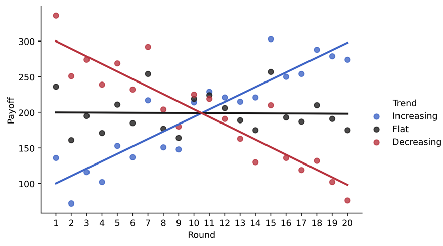
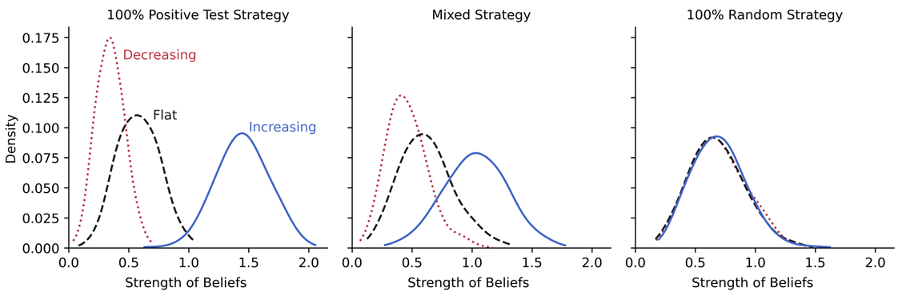
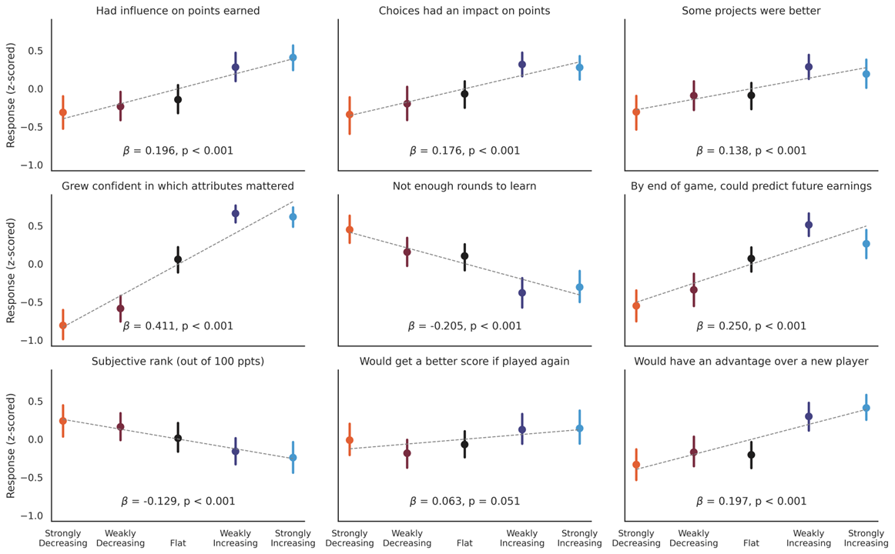

## Sleeping Like a Baby

In November 2022, my wife and I welcomed our first child into our lives. It turns out a lot of things change when you go from zero to one kid... the most dramatic change of all being the amount of sleep that you get.

A few parents are apparently blessed with "unicorn babies" who quickly learn how to sleep through the night. Good for them. The majority of parents will learn the hard way that "sleeping like a baby" is one of the most misleading idioms of the English language. For the least fortunate of parents, baby sleep will even become a source of existential dread. The type of dread that will lead you to buy (but never read) 800-page-long treaties on baby sleep; to endlessly scroll "sleep consultant" accounts on Instagram for guidance; or to ask reddit at 2AM "why is my child waking up every two hours". 

As you can guess from these suspiciously detailed examples, I was one of these parents. These late-night scrolling sessions taught me three things:
1) Parents often believe they've found a "strategy" that helped their kids sleep through the night.
2) These strategies can be very specific. I mean VERY:

3) These strategies rarely agree with each other: More naps! Fewer naps! Longer naps! Earlier bedtime! Later bedtime! Wean the bottle at once! Wean it gradually! Colder room! Warmer room! 

## Becoming a Baby-Sleep Expert

Faced with such conflicting advice, we did the only reasonable thing for two parents with PhDs: We recorded data on the quality of each night, and tried different things to help our kid sleep better. Anytime something appeared to result in a bad night, we steered clear of it. Anytime something appeared to result in a good night, we stuck to it.

We did this for 70 days, and we quickly started noticing improvements in the quality of our kid's sleep. Check for yourself: She went from sleeping a maximum of ~4 hours in a row to ~6.5 hours! 

We were proud of ourselves: Like the other parents on reddit, we had "cracked the code" of baby sleep!

Except that's not what happened. I mean, we did collect data on our kid's sleep, and the data that I've shown you is the real data. In this period of time however, we did not make any change to our kid's schedule or bedtime routine. She just became better at sleeping, like all babies do. 

... But what if we had made changes? What if we had gone through this process of trial-and-error, trying to identify what helps her sleep better at night? I believe that, like many other parents, we would have attributed this natural improvement to our efforts... and that we would have formed confident (but misguided) beliefs in the specific factors that help our kids sleep longer at night. 

## A Model of Learning Under Exogenous Influences

What makes me believe this? Turns out my co-author [Bart de Langhe](https://www.bartdelanghe.com/) and I have been studying a general form of the "baby sleep" problem: How people form beliefs about cue-outcome relationships in the presence of exogenous trends (improvement or worsening in the quality of the outcomes over time, independently of the decision makers' actions). As part of this work, we have come up with a model describing how positive exogenous trends can shape stronger (yet less accurate) beliefs in how cues relate to outcomes. 

This model is pretty straightforward, and relies on two fundamental aspects of human learning.

1. People rarely compare outcomes to the appropriate counterfactual. To test whether an earlier bedtime leads to a better night of sleep for your baby, you would need to know what would have happened if you didn't change the bedtime. Unfortunately, this counterfactual is rarely accessible. Instead, people tend to monitor progress over time, and to attribute changes in the outcome to their actions.

2. People do not explore all alternatives when learning about cue-outcome relationships. Instead, they follow what is called a "positive test strategy": They take actions they believe are likely to result in better outcomes, and verify that they indeed obtain better outcomes. This is particularly true when negative outcomes are costly: If you believe that a later bedtime is hurting your baby's ability to sleep well, you will not risk inflicting a horrible night of sleep on yourself to verify this hypothesis. Instead, you will stick to an earlier bedtime, and check that your baby is sleeping better.

Under these conditions, it becomes clear that positive trends will distort people's learning. If people consistently choose alternatives they believe will result in better outcomes, a factor that improves outcomes over time will appear to “validate” people's current beliefs, regardless of the accuracy of these beliefs. This is how parents would become persuaded that they are baby sleep experts...

## A Paradigm To Study Learning Under Exogenous Influences

Now does this happen in practice, or is the phenomenon restricted to sleep-deprived parents? To answer this question, 
Bart and I created interactive cue-learning tasks, and used them to study people's learning in the presence of exogenous trends.

The specifics of these cue-learning tasks differ from one study to another, but the general structure is always the same:

1) Participants are trying to learn, over multiple trials (called "rounds"), the relationship between a set of cues (e.g., the characteristics of investment prospects) and an outcome (the ROI of the investment).
2) Each round, participants see a set of three prospects that differ along several attributes. In the example below, the prospects are investment opportunities, characterized by four attributes (company valuation, sector of activity, market size, and number of competitors). They are asked to choose one of these prospects. 

3) After choosing a prospect, they observe the outcome associated with the chosen prospect... but do not observe the outcomes associated with the foregone prospects. 

This "selected learning" is a central feature of paradigm. In traditional cue-learning tasks, participants are passively 
exposed to cue-outcome pairs. In our paradigm, participants actively choose the alternatives, and thus influence the 
cue-outcome combinations that they observe. This feature allows us to study how the selection process of alternatives will
influence people's learning.

A second key feature of our paradigm is that the outcomes are not influenced by the cues: regardless of which prospect
is chosen by the participant in a given round, they will observe the same outcome. Instead, the outcomes are manipulated 
between participants to increase (vs. stay constant, or decrease) over time. The participants are, of course, not aware 
of this. Here's an example of how the outcomes were manipulated in one of our studies:

## Testing the Model In Silico

We now have a model, and a paradigm to test it. Before recruiting data from human participants, we tested
the model *in silico*. We programmed simulated agents, placed them in the learning environment that I have 
just described, and tested whether their beliefs would indeed be distorted by exogenous trends.

I won't get into the nitty-gritty details of the simulation, but here's the gist:
* We initialize agents with random initial beliefs about how the cues relate to outcomes, and place them in the interactive cue-learning task we've described.
* The agents choose a prospect each round, and update their beliefs depending on how the observed outcome compares to the ones they've obtained in the past:
  * If the outcome is **better**, the attributes of the chosen prospect are reinforced as **positive** predictors of performance.
  * If the outcome is **worse**, the attributes of the chosen prospect are reinforced as **negative** predictors of performance.

We manipulated two things about the agents:
* The agents' learning strategy. A third of the agents relied on the "positive test strategy", such that 
they were more likely to learn from the "best prospect" (according to their current beliefs) each round. Another third were programmed 
to learn at random: They chose a random prospect each round. The final third, finally, was equally likely each round to choose at random or to follow the positive test strategy.
* The outcomes that the agents observed were manipulated to increase, stay constant, or decrease over the twenty rounds.

After twenty rounds of learning, what do the beliefs of these different kind of simulated agents look like? The graph below shows you the
absolute strength of the beliefs that the agents have formed about the cues (i.e., how strongly they believe the cues 
actually predict the outcomes), as a function of the exogenous trend they have been exposed to (lines) and of the learning 
strategy they have followed (panels).

Looking at the left panel first, we see a first prediction of our model come to life: Among agents relying on the positive test strategy, 
positive exogenous trends lead to stronger beliefs that the cues predict the outcomes. These agents tested the cues they 
believed to be associated with better outcomes, and the positive trend "validated" their beliefs. On the contrary,
the negative exogenous trend provided a systematic "disconfirmation" of their hypothesis, and led to weaker beliefs.

The other two panels confirm a second prediction of our model: The impact of exogenous trends on the strenght of beliefs is 
moderated by the agent's reliance on the positive test strategy. When agents always test hypothesis at random (i.e., do not systematically learn
from the "best" prospects), the exogenous trends had no effect on the strength of their beliefs.

## Testing the Model with Human Participants

I like this simulation because it provides clear evidence that the two pillars of our model (an inappropriate comparison process, 
and a positive test strategy) are sufficient to explain how exogenous trends would systematically distort people's beliefs. What this simulation doesn't tell us, however, is whether these distortions would also be observed in real 
people, whose learning strategies are influenced by a myriad of other factors... 

The next logical step was to collect data from human participants. We ran many studies: Using exploratory and confirmatory measures; 
with MTurk workers, students, and even a few senior executives; with different types of cue-learning tasks, different kinds of instructions, and different measures of people's beliefs. The effect
turns out to be remarkably robust. Again, I won't go into the details, and will instead present a few highlights.

### Exogenous Trends Affect the Strength of People's Beliefs and Their Confidence in These Beliefs

Across a battery of exploratory measures, we find that people report stronger and more confident beliefs after learning
in the presence of positive exogenous trends. They're more confident that they understand how the cues relate to the outcomes,
that they had an influence on the outcomes, that some prospects were better than others, that they understand the game better than others,
that they have performed better than others, and that they would perform better if they re-did the task.

### Positive Exogenous Trends Increase People's Reliance on the Positive Test Strategy

When analyzing the participants' choices of prospects during the cue-learning task, we found something pretty remarkable:
Participants learning in the presence of positive exogenous trends were *even more likely* to learn from the "best" prospects, 
and even less likely to learn from alternative prospects. This result suggests that positive exogenous trends can create 
feedback loops: They strengthen people's pre-existing beliefs, which encourages them to lean into the positive test strategy, 
which will ultimately lead to even stronger beliefs.

### The Effect Persists When People Are Encouraged and Incentivized to Learn

Does the effect only emerge because people are trying to maximize the outcome? In other words, would they still rely on
the positive test strategy if they were not concerned about obtaining good outcomes, and free to explore?

To be sure, we ran a replication in which participants are explicitly instructed to learn as much as possible from the task. We
repeatedly tell them that they shouldn't try to earn good outcomes, but instead to develop an accurate understanding of 
how the cues relate to outcomes. We also incentivized them to learn: They receive a bonus payment that depends on their 
ability to identify how the cues relate to the outcomes. Despite these instructions and incentives, the effect of exogenous trends on people's
learning persists. 

### The Effect Persists When People Are Asked to Describe Their Beliefs

Bart and I have extensively used this paradigm with students (to teach them about the difficulties of learning from
experience and the benefits of experimentation), and we've always been struck by how confident students are in their
beliefs after learning in the presence of positive exogenous trends. When asked to describe their beliefs, they are often
capable of articulating detailed and coherent theories about how the cues relate to the outcomes. 

To be sure, we ran studies in which participants were asked to describe how exactly the attributes of the prospects 
predicted the outcomes. Again, we found that participants exposed to positive exogenous trends reported more precise beliefs
in how the cues predicting the outcomes, and were more confident in these beliefs. This result confirms that the
confidence induced by positive exogenous trends isn't just a superficial "illusion of explanatory depth" facilitated by
the good outcomes obtained by participants.

## Parents, Crypto Traders, and Other Victims of Exogenous Trends

We already knew that learning from experience is hard, particularly in "wicked" environments (where the outcomes and/or 
cues are volatile, uncertain, complex and ambiguous). Normatively, positive exogenous trends are a source of volatility: They
should thus complicate learning and lead to less confident beliefs. Our results suggest that the opposite is true: Because of
the peculiar way in which we test our hypotheses about the world, positive exogenous trends will appear to systematically 
reinforce our beliefs... even when these beliefs are wrong.

These effects are, in our experiments, remarkably strong and robust. While they are probably smaller in the real world,
we think that our model provides insights into why new parents can become persuaded that they understand the vagaries of baby sleep (at least 
until their second born gives them a brutal reality check...); how crypto traders came to believe they could predict the future price of coins 
at the height of the 2020 bull run; or why many LinkedIn influencers claim to understand the factors that predict the success of a post [^1]...

[^1]: Turns out the more you post (holding quality constant), the more followers you accumulate... and thus the more views your future posts will get. Positive exogenous trends strike again!
