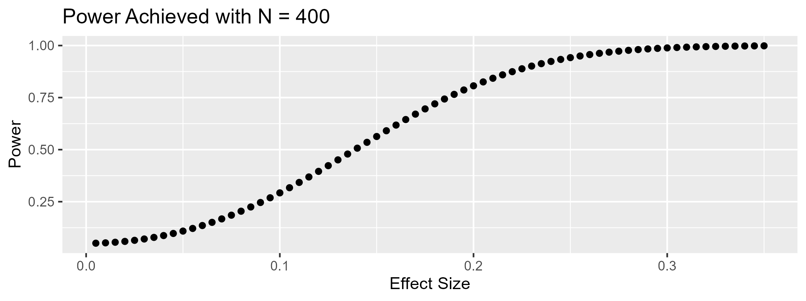

As discussed in a [previous blog post](), a core issue with power analysis is that it asks researchers to guess the effect size that their experiment will produce… but that they are, in most cases, unable to make this prediction. How should researchers set their sample size then?

## What Do Researchers Know?
If researchers do not know and cannot predict the effect size that their experiment will yield, it turns out that they can use other knowledge to make thoughtful sample size decisions. 

First, researchers can rely on the “Smallest Effect Size Of Interest” (SESOI) approach. In this framework, the researcher will choose their sample size not according to the expected effect size (which, again, can hardly be predicted) but instead according to the smallest effect size that they are interested in detecting. There are various ways of determining this SESOI: I’m referring you to [Daniël Lakens’ tutorial here for a comprehensive treatment of the issue](https://lakens.github.io/statistical_inferences/09-equivalencetest.html#sec-sesoi). 

Let’s use an example here. A researcher studying an anchoring effect learns, through a literature review, that anchoring effects are rarely smaller than d = .2. They thus determine d = .2 as their Smallest Effect Size of Interest. Armed with this estimate, they run a power analysis and learn that they need to set N = 786 to give themselves at least 80% chance of detecting an effect as small as d = .2 with a two-sample t-test.

Now, consider a researcher who is completely clueless about effect sizes: They have no idea what is "large" or "small". Turns out that they still know something valuable: How much money they feel comfortable spending on this study. As basic as it sounds, knowing how much you want or can afford to spend on a study can be a valuable input into different kinds of power analysis. Rather than calculating how many participants you need to detect a given effect size with a desired level of power, the researcher can use this information to determine 1) the effect size that this sample size allows them to detect with a given level of power, or 2) the level of power that this sample size affords them for a given effect size. 

Let’s again use an example. A researcher has determined that they can collect up to 400 observations for their two-cell experiment. Using the types of power analysis we have just described, they can for instance determine that 1) the smallest effect size that they can detect with 80% power is d = .28, or that 2) if they study an effect size of d = .15, they will have 32% power to detect it. They can even draw a power curve, like the one below, showing how much power they would have to detect effects of different sizes.
 

## More Useful, But Potentially Wasteful
While both approaches are undeniably more tractable than attempting to guess the “average” effect size, they are also costlier: Setting N based on the Smallest Effect Size of Interest means powering the study for the “worst case scenario,” and setting N based on financial resources means spending the full amount that the researcher feels comfortable spending.

In many circumstances however, researchers could “get away” with collecting fewer observations. Anytime the true effect size of the experiment is larger than the SESOI (or anytime the power afforded by the researcher’s resources is greater than the target power they wish to achieve), the researcher will have collected more data than they wanted or needed.

## What’s The Solution Then?
With traditional designs, researchers are stuck between a rock and a hard place. On the one hand, choosing their sample size based on the expected effect size would give them the desired level of power… but they cannot predict this effect size with sufficient accuracy. On the other hand, setting sample size based on the SESOI, or using their budget constraints, ensures that they have the maximum amount of power that they want or can afford… but will often lead them to collect "too much" data.

The ideal solution for researchers would be an experimental design that can be powered to detect a smallest effect size of interest, and that can be interrupted early when the effect size turns out to be larger than this SESOI. On this front, I have good news, bad news, and good news. 

The good news is that these designs exist. They are called Group Sequential Designs, and they allow researchers to conduct repeated hypothesis tests on their data without inflating false-positive rates. These repeated hypothesis tests allow researchers to run studies powered to detect a SESOI, and to terminate data collection whenever the effect is large enough to reject the null.

The bad news is that these designs, while widespread in clinical trials and biostatistics, are virtually nonexistent in consumer behavior and behavioral sciences [^1].

The good news is that, in recent years, tutorials [such as Lakëns and colleagues’](https://osf.io/preprints/psyarxiv/x4azm) have started raising awareness about these designs. In fact, my colleague Nick Reinholtz and I have been working on a practical tutorial targeted at consumer researchers: We offer a practical method to facilitate the adoption of these techniques (including a web app researchers can use), explain their benefits to consumer researchers, and simulate their cost-savings potential in a re-analysis of consumer research experiments. You can [find the pre-print here](https://papers.ssrn.com/sol3/papers.cfm?abstract_id=4561485). 

Stay tuned for the third (and final) blog post describing the key insights of our paper!

[^1]: In fact, the only paper I know that relies on group sequential designs [incorrectly applies the method]( https://doi.org/10.1073/pnas.2000065117).
