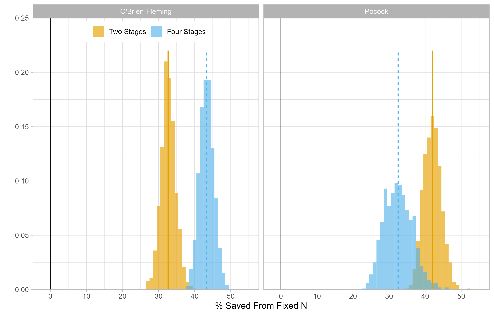

In a [first blog post](), we have discussed a core issue of power analysis: It requires researchers to predict the effect size that their experiment will yield, but they are, in most cases, unable to make this prediction.

In a [second blog post](), we have discussed a possible solution to this issue: Rather than powering for the *expected* effect size, researchers can power for the *smallest* effect that they are interested in detecting, or can afford to detect. While this approach guarantees that the experiment will give an informative answer, it forces researchers to collect a lot more data than they need whenever the effect is larger.

In this third blog post, we are going to discuss a set of techniques that allow researchers to power studies for the worst case scenario... but that will stop data collection earlier when the effect is larger than expected. 

## An Short Introduction to Group Sequential Designs

In traditional designs, researchers must collect all their data before they can test their hypothesis [^1]. This constraint is inherent to null-hypothesis significance testing: If researchers repeatedly test for the presence of an effect while data collection is ongoing, they will inflate their false-positive rate. For instance, if a researcher tests the same hypothesis twice (once after collecting half the data, then a second time after collecting the full data) against the critical value $\p_crit$ = .05, the overall false-positive rate of this procedure will be \alpha = .083 (rather than the desired \alpha = .05) [^2].

This limitation is costly for researchers: It means that whenever the effect size is larger than expected, they will collect "too much" data (i.e., more than they need to achieve a decent amount of statistical power)... but will learn this after the data has already been collected. 

Group Sequential Designs, on the other hand, do not have this constraint. These designs allow researchers to conduct a pre-specified number of interim hypothesis tests on their data, and to terminate data collection whenever the effect is large enough to reject the null, all the while keeping false-positive rates at a nominal level.

How? By conducting each of these hypothesis test against a stricter critical value. If, in the example above, the researcher performs each test against $\p_crit$ = .0294$ rather than $\p_crit$ = .05$, then the false-positive rate across the two tests will be exactly alpha = .05.

Now, if Group Sequential Designs can be so simple, why aren't they used more often? We think it reflects a mix of a lack of guidance on how to implement them, a lack of awareness about their benefits, and a fear that the technique will not be perceived as legitimate by reviewers. 

Enter PRIADs: Our proposal to increase the adoption of group sequential designs in consumer research! The full paper is available on [SSRN](SSRN), and the highlights of the paper are below.

## PRIADs Help Researchers Design More Informative Studies

Traditional "Fixed N" studies are powered to detect an average effect size. When these studies fail to deliver a significant result, it is thus unclear what the researcher should learn: Should they conclude that they mispredicted the average effect size, or that the effect is too small to be interesting?

PRIADs, on the other hand, are powered to detect the smallest effect size that researchers are interested in (or can afford to) studies. This different approach makes null results much more informative: They send a credible signal to the researcher that the effect is too small to be detected given their resources, and that they should thus redirect their resources to other projects.

## PRIADs Are (Typically) More Cost-Efficient Than Fixed N Studies

In typical circumstances, PRIADs are more cost-efficient than Fixed N designs. Our simulations show that, as long as researchers have more than 25% power to detect an effect, PRIADs can achieve a given level of power with a smaller number of observations. At higher levels of statistical power (e.g., 55%), all PRIADs start delivering significant savings compared to Fixed N designs.

This is a theoretical result, but would these savings materialize in practice? To answer this question, we conducted a re-analysis of all the pre-registered studies with open data published in JCR. We were able to find 104, and managed to reproduce the results of 101 of them. We simulate, for each study, what would have happened if researchers had used a PRIAD rather than a Fixed N study. We consider the four kinds of "off-the-shelf" PRIADs we discuss in the paper

The figure below shows the outcome of the studies. Using Fixed N designs, researchers always collected the full sample, and found a significant result in 95% of the studies. If the researchers had used PRIADs instead, they would have often stopped data collection much earlier: In half of the studies, PRIADs would have found a significant result after collecting only half the data!

What about statistical power? The figure shows that most of the studies that reached significance with a Fixed N study would have also reached significance with a PRIAD (between 84% and 100%, depending on the type of PRIAD) .

Finally, what does this imply for cost-savings? Let's be conservative and go with a sizeable penalty for non-significance: Whenever a researcher fails to find a significant result with a PRIAD, we will assume they will re-run the study with twice the sample size. This means that a "failed" PRIADs results into cost-savings of minus 200%. 

The second figure shows that, even under this conservative assumption, the authors of the studies in our re-analysis would have saved between 32% and 43% of the original participant counts!

## When Are PRIADs Appropriate?

Our manuscript clarifies the conditions under which PRIADs are valid tools for researchers, and offers guidelines to readers and researchers to evaluate the design and results of PRIADs. Again, the highlights are:

1. PRIADs need to be pre-registered. We know the damages uncontrolled researchers degrees of freedom can inflict on a field, which is why we require PRIADs to be accompanied by a detailed pre-registration. When evaluating PRIAD-based studies, readers and reviewers should carefully check that the reported design and analysis matches the pre-registration.

2. PRIADs are only appropriate in the context of confirmatory hypothesis testing. They are not suited to exploratory studies, or for studies that aim at quantifying the magnitude of a phenomenon.

## How Can I Use PRIADs in my Research?

As we have discussed, the logic of Group Sequential Designs is very straightforward: Commit to a pre-specified number of hypothesis tests, and conduct each of them against stricter critical values. In practice, however, Group Sequential Designs require researchers to make a number of decisions: How many hypothesis tests to conduct, and at which point during the data collection process? Which critical values to test against? How many observations to collect?

We simplify these decisions in two ways. We offer four "off-the-shelf" group sequential designs (that researchers can immediately use in their research); and propose a streamlined procedure for designing custom group sequential designs:

1. First, decide on the maximum number of observations that the design might collect should the experiment proceed to its end. This choice can be informed by cost considerations, by a Smallest Effect Size Of Interest analysis, or by a belief on the smallest expected effect.

2. Then, choose many interim analyses to conduct. Conducting more interim analysis means more opportunities to stop early... but results in a greater loss of statistical power (since the final tests are conducted against a more stringent rejection threshold).

3. Then, choose when to conduct the interim analysis. These are typically spread uniformly (e.g., at 25%, 50%, 75% and 100% of data collection).

4. Finally, choose the type of correction to apply to statistical tests. PRIADs give researchers a choice between the Pocock correction (which maximizes the odds of an early stop, at the expense of a less powerful statistical test at the final analysis) and the O'Brien-Fleming correction (which maximizes the power of the final test, but makes early stops less likely). 

5. Optionally, choose whether and when to stop for "futility": Interrupt the study before its end if an interim analysis reveals underwhelming support for the researcher's hypothesis.

To help researchers make these decisions, we have designed [PRIApp](https://priadconsumerresearch.shinyapps.io/PRIApp/): An interactive Shiny app that allows researchers to design PRIADs and simulate their outcomes. For researchers who do not want to make these decisions themselves, our paper also offers four "off-the-shelf" PRIADs.

[^1]: As it turns out, [scientists do not always abide by this restriction](https://journals.sagepub.com/doi/10.1177/0956797611430953).
[^2]: If you are wondering why the false positive rate is not .1 (i.e., .05 x 2), it is because the two tests are not independent: The second test is based in part on the data that was used in the first test, and thus correlated with the first test.
