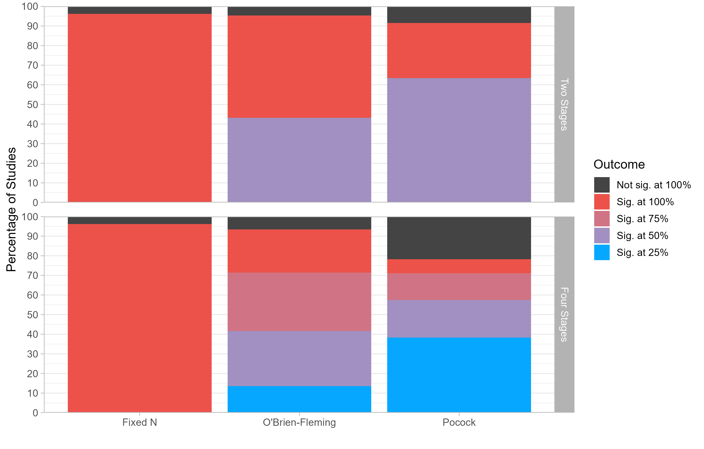

NOTE: Due to two mistakes that previously existed in this research, some of the numbers originally described in this blog post were incorrect. This post was updated on April 11th 2024 to reflect the updated (and now correct) numbers. I apologize for this error. If you want to learn more, [check out this other blog post]().

In previous blog posts, we have discussed [a core issue of power analysis]() (it requires researchers to predict the effect size that their experiment will yield, something that is often impossible to do accurately) and [a costly solution to this issue]() (powering studies for the smallest effect size that researchers are interested in detecting or can afford to detect).

In this third blog post, we are going to discuss a better solution to the problem of sample size determination: Group sequential designs. These designs can be powered to detect the smallest effect size researchers care about... and will stop data collection earlier whenever the effect is larger than expected.

## What Are Group Sequential Designs?

In traditional "Fixed N" designs, researchers must collect all their data before they can test their hypothesis [^1]. This constraint is inherent to null-hypothesis significance testing: If researchers repeatedly test for the presence of an effect while data collection is ongoing, they will inflate their false-positive rate. For instance, if a researcher tests the same hypothesis twice (once after collecting half the data, then a second time after collecting the full data) against the critical value $p_{crit}$ = .05, the overall false-positive rate of this procedure will be $\alpha$ = .083 (rather than the desired $\alpha$ = .05) [^2].

This limitation is costly for researchers: It means that whenever the effect size is larger than expected, they will collect "too much" data (i.e., more than they need to achieve a decent amount of statistical power)... but will learn this after the data has already been collected. 

Group sequential designs, on the other hand, do not have this constraint. They allow researchers to conduct a pre-specified number of interim hypothesis tests on their data, and to terminate data collection whenever the effect is large enough to reject the null... all the while keeping false-positive rates at a nominal level.

How? By conducting each of these hypothesis tests against a stricter critical value. If, in the example above, the researcher performs each test against $p_{crit}$ = .0294 rather than $p_{crit}$ = .05, then the false-positive rate across the two tests will be exactly $\alpha$ = .05.

Now, if group sequential designs can be so simple, why aren't they used more often? Probably a mix of a lack of guidance on how to implement them, a lack of awareness about their benefits, and a fear that the technique will not be perceived as legitimate by reviewers.

This adoption gap motivated us (Nick Reinholtz and I) to write a paper called "Pre-Registered Interim Analysis Designs (PRIADs): Increasing the Cost Effectiveness of Hypothesis Testing". This paper offers a practical procedure (called PRIAD) to facilitate the adoption of group sequential designs in consumer research. It also highlights the benefits that group sequential designs can unlock for researchers, and discusses the conditions under which they can offer a valid alternative to "Fixed N" designs.

To celebrate the acceptance of this paper at the Journal of Consumer Research, I'm summarizing the key insights in this blog post. If you want to learn more, you can find the accepted version [on the OSF repository of this project](https://osf.io/864ef).

## The Benefits of PRIADs

Why might consumer researchers be interested in PRIADs? We show that they have multiple benefits over Fixed N designs:

### They Allow Researchers to Manage Effect Size Uncertainty, and Deliver More Informative Null Results

With traditional "Fixed N" studies, researchers face a difficult dilemma: 

* They can power their studies for the  effect size they expect. This approach is risky: If the effect size is smaller than expected, the study will be underpowered, and the researcher will not be able to draw meaningful conclusions from null results.
* They can power their studies for the smallest effect size they are interested in. This approach is expensive: Researchers will collect much more data than they need whenever the effect is larger.

PRIADs achieve a valuable trade-off between these two extremes:

* They can be powered to detect the smallest effect size that researchers are interested in (or can afford to) studies, which makes null results informative: A null result sends a credible signal to the researcher that the effect is too small to be detected given their resources, and that they should thus redirect their resources to other projects.
* They allow researchers to stop data collection early whenever the effect is larger than expected. This means that, in practice, researchers will often collect less data than they would have with a Fixed N design.

Which brings us to our next point...

### They Are (Typically) More Cost-Efficient Than Fixed N Studies

Greater cost-efficiency, in the context of hypothesis testing, means that a design is able to achieve a given level of power while collecting a smaller number of observations. 

Our paper reports simulations showing that, in most circumstances, PRIADs are more cost-efficient than Fixed N designs:

* As long as researchers have more than 25% power to detect an effect, some PRIADs can achieve equivalent power while collecting a smaller number of observations.
* At higher levels of statistical power (e.g., 55%), all the PRIADs that we discuss in the paper are more efficient.

This is a theoretical result, but would these savings materialize in practice? To answer this question, we conducted a re-analysis of all the pre-registered studies with open data published in JCR. We were able to find 223 studies, and managed to reproduce the results of 212 of them. We simulate, for each study, what would have happened if researchers had used a PRIAD rather than a Fixed N study. We consider the four kinds of "off-the-shelf" PRIADs that we discuss in the paper.

The figure below shows the outcome of the studies. Using Fixed N designs, researchers always collected the full sample, and found a significant result in 95% of the studies. If the researchers had used PRIADs instead, they would have often stopped data collection much earlier: In half of the studies, group sequential designs would have found a significant result after collecting only half the data!

What about statistical power? The figure shows that most of the studies that reached significance with a Fixed N study would have also reached significance with a group sequential design (between 81% and 99%, depending on the type of PRIAD) .

Finally, what does this imply for cost-savings? Let's be conservative and go with a sizeable penalty for non-significance: Whenever a researcher fails to find a significant result with a PRIAD, we will assume they will re-run the study with twice the sample size. This means that a "failed" group sequential design results into cost-savings of minus 200%. 

Our analyses show that, even under this conservative assumption, the authors of the studies in our re-analysis would have saved between 20% and 29% of the original participant counts.

### They Allow to Save Resources When Conducting Pilot Studies

We occasionally use pilot studies to calibrate our stimulis or dependent measures: We typically run a small sample study (the “pilot”), analyze the data, and run a full-sample version of this study if the results of the pilot are promising enough. 
However, this approach is wasteful: The data of a “successful” pilot study will be discarded, and only the data from the full-sample study is used in testing the hypothesis. 

In the paper, we show that PRIADs can be used to make pilot studies more efficient: Researchers can design a PRIAD in which the pilot study corresponds to the first interim analysis, and the full-sample study corresponds to the final analysis. With this approach, the data of a successful pilot will not be discarded, saving the researcher some money.

## When Are PRIADs Appropriate?

Our manuscript clarifies the conditions under which PRIADs are valid tools for consumer researchers, and offers guidelines to readers and researchers to evaluate the design and results of PRIADs

In a nutshell, PRIADs are appropriate tools:
1. When they are pre-registered. We know the damages uncontrolled researchers degrees of freedom can inflict on a field, which is why we require all PRIADs to be accompanied by a detailed pre-registration. When evaluating PRIAD-based studies, readers and reviewers should carefully check that the reported design and analysis matches the pre-registration.
2. When used in the context of confirmatory hypothesis testing. They are not suited to exploratory studies, or for studies that aim at quantifying the magnitude of a phenomenon.
3. When researchers face a meaningful trade-off between statistical power and resources. If researchers have access to a convenience sample of a given size for instance, it doesn't make sense to use a PRIAD: They should just collect all the data they have access to.

## How To Design PRIADs?

At a high level, the logic of group sequential designs is pretty straightforward: 
* Choose the maximum number of observations you want to collect
* Commit to a pre-specified number of hypothesis tests, and conduct each of them at pre-specified timings against stricter critical values. 
* Stop data collection as soon as one of your hypothesis tests is able to reject the null.

In practice, however, group sequential designs require researchers to make a number of decisions: What should determine the maximum number of observations that I want to collect? How many hypothesis tests should I conduct? At which point during the data collection process? Which critical values should I choose? What can I do if my data shows underwhelming support for the alternative hypothesis? 

PRIAD is a practical procedure to help researchers make these decisions. We outline the five decisions involved in creating a group sequential design, explain the intuition behind each of them, and provide guidelines to researchers.

1. First, researchers decide on the maximum number of observations that the design might collect should the experiment proceed to its end. This choice can be informed by cost considerations, by a Smallest Effect Size Of Interest analysis, or by a belief on the smallest expected effect.

2. Then, choose many interim analyses to conduct. Conducting more interim analysis means more opportunities to stop early... but results in a greater loss of statistical power (since the final tests are conducted against a more stringent rejection threshold).

3. Then, choose when to conduct the interim analysis. These are typically spread uniformly (e.g., at 25%, 50%, 75% and 100% of data collection).

4. Finally, choose the type of correction to apply to statistical tests. PRIADs give researchers a choice between the Pocock correction (which maximizes the odds of an early stop, at the expense of a less powerful statistical test at the final analysis) and the O'Brien-Fleming correction (which maximizes the power of the final test, but makes early stops less likely). 

5. Optionally, choose whether and when to stop for "futility": Interrupt the study before its end if an interim analysis reveals underwhelming support for the researcher's hypothesis.

As the name of the procedure suggests, these decisions need to be pre-registered: Researchers should specify all the decisions they have made before they start collecting data, and should not deviate from these decisions once the data collection has started.

To help researchers make these decisions and generate the corresponding pre-registration, we have designed [PRIApp](https://priadconsumerresearch.shinyapps.io/PRIApp/): An interactive Shiny app that allows researchers to design PRIADs and simulate their outcomes. 

For researchers who do not want to make these decisions themselves finally, our paper also offers four "off-the-shelf" PRIADs.

## Conclusion

The cost of publishing a consumer behavior paper has noticeably increased over the past decade. Papers tend to not only include more studies, but also more expensive studies (e.g., larger sample sizes, representative samples, incentive-aligned decisions, field studies, etc.). There is growing concern that this rising cost will have a negative impact on the field, as this could amplify the advantage held by scholars from well-funded institutions and limit marginalized scholars’ opportunities to establish valuable contributions.

We hope that PRIADs can reduce the barriers to conducting rigorous research, and help researchers to make the most of their resources. We are excited to see how the marketing community will react to this tool, and are looking forward to seeing the first studies that will use PRIADs to test their hypotheses!

[^1]: As it turns out, [scientists do not always abide by this restriction](https://journals.sagepub.com/doi/10.1177/0956797611430953).
[^2]: If you are wondering why the false positive rate is not .1 (i.e., .05 x 2), it is because the two tests are not independent: The second test is based in part on the data that was used in the first test, and thus correlated with the first test.
